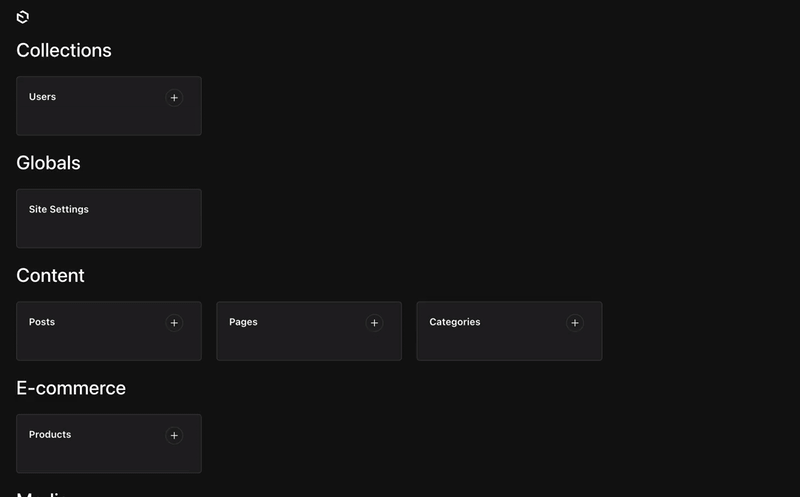
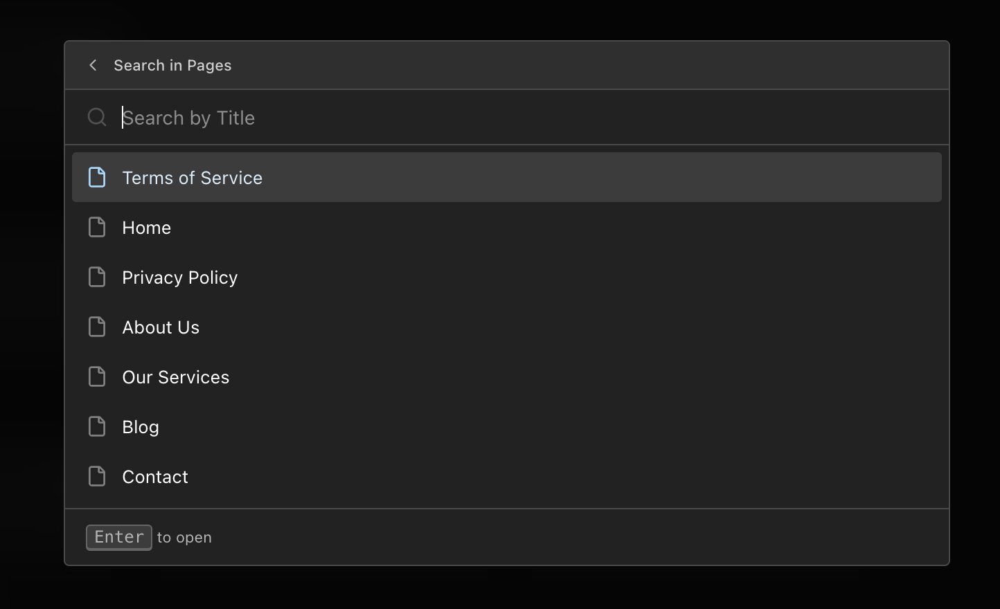

# Payload CMDK

A powerful command menu plugin for [Payload CMS](https://payloadcms.com) that enhances navigation and accessibility within the admin panel. Quickly search and navigate through collections, globals, and custom actions using keyboard shortcuts.



## Features

✨ **Quick Search** - Instantly search across all collections and globals

⌨️ **Keyboard Shortcuts** - Fully customizable keyboard shortcuts powered by [react-hotkeys-hook](https://react-hotkeys-hook.vercel.app/docs/intro)

🔍 **Collection Submenu** - Search within collection documents by their title field

🎨 **Custom Icons** - Use any [Lucide icon](https://lucide.dev/icons) for collections and globals

🎯 **Custom Items** - Add custom actions and menu groups

🌍 **i18n Support** - Built-in English and Ukrainian translations, easily add your own

🖥️ **Cross-platform** - Optimized shortcuts for both macOS and Windows/Linux


## Installation

```bash
npm install @veiag/payload-cmdk
# or
yarn add @veiag/payload-cmdk
# or
pnpm add @veiag/payload-cmdk
```

## Quick Start

The plugin works out of the box with minimal configuration:

```typescript
import { payloadCmdk } from '@veiag/payload-cmdk'
import { buildConfig } from 'payload'

export default buildConfig({
  // ... your config
  plugins: [
    payloadCmdk({
      // Plugin works without any options!
    }),
  ],
})
```

This will:
- Add a search button to the admin panel
- Enable `⌘K` (Mac) / `Ctrl+K` (Windows/Linux) keyboard shortcut
- List all collections and globals in the command menu
- Enable collection submenu search

## Configuration

### Full Configuration Example

```typescript
import { payloadCmdk } from '@veiag/payload-cmdk'
import { buildConfig } from 'payload'

export default buildConfig({
  plugins: [
    payloadCmdk({
      // Keyboard shortcut to open the menu
      shortcut: ['meta+k', 'ctrl+k'], // Default

      // Search button configuration
      searchButton: {
        position: 'actions', // 'actions' | 'nav'
      },

      // Backdrop blur effect
      blurBg: true, // Default

      // Collection submenu configuration
      submenu: {
        enabled: true, // Default
        shortcut: 'shift+enter', // 'shift+enter' | 'enter'
        icons: {
          posts: 'FileText',
          users: 'User',
        },
      },

      // Custom icons for collections and globals
      icons: {
        collections: {
          posts: 'FileText',
          pages: 'File',
          media: 'Image',
          users: 'Users',
        },
        globals: {
          settings: 'Settings',
          navigation: 'Menu',
        },
      },

      // Collections/globals to ignore
      slugsToIgnore: ['payload-migrations', 'payload-preferences'],

      // Custom menu items
      customItems: [
        {
          type: 'group',
          title: 'Quick Actions',
          items: [
            {
              type: 'item',
              slug: 'view-site',
              label: 'View Site',
              icon: 'ExternalLink',
              action: {
                type: 'link',
                href: 'https://your-site.com',
              },
            },
            {
              type: 'item',
              slug: 'clear-cache',
              label: 'Clear Cache',
              icon: 'Trash2',
              action: {
                type: 'api',
                method: 'POST',
                href: '/api/cache/clear',
              },
            },
          ],
        },
      ],

      // Disable the plugin
      disabled: false, // Default
    }),
  ],
})
```

## Configuration Options

### `shortcut`

Keyboard shortcut to open the command menu. Powered by [react-hotkeys-hook](https://react-hotkeys-hook.vercel.app/docs/intro).

- **Type:** `string | string[]`
- **Default:** `['meta+k', 'ctrl+k']`

The default provides cross-platform support:
- `meta+k` - Works on macOS (⌘K)
- `ctrl+k` - Works on Windows/Linux (Ctrl+K)

**Examples:**

```typescript
// Single shortcut
shortcut: 'ctrl+shift+k'

// Multiple shortcuts for cross-platform support
shortcut: ['meta+k', 'ctrl+k']

// Custom combinations
shortcut: ['meta+/', 'ctrl+/']
```


### `searchButton`

Configuration for the search button displayed in the admin panel.

- **Type:** `{ position?: 'actions' | 'nav' } | false`
- **Default:** `{ position: 'actions' }`

**Options:**
- `position: 'actions'` - Display in the action buttons area (default)
- `position: 'nav'` - Display in the navigation sidebar
- `false` - Hide the search button completely (keyboard shortcut still works)

**Examples:**

```typescript
// Display in navigation
searchButton: {
  position: 'nav'
}

// Hide search button
searchButton: false
```
Actions button position:


Navigation button position:


### `blurBg`

Enable backdrop blur effect when the command menu is open.

- **Type:** `boolean`
- **Default:** `true`

```typescript
blurBg: false // Disable blur effect
```

### `submenu`

Configure submenu behavior for searching within collection documents.

- **Type:** `object`
- **Default:** `{ enabled: true, shortcut: 'shift+enter' }`

**Options:**

| Property | Type | Default | Description |
|----------|------|---------|-------------|
| `enabled` | `boolean` | `true` | Enable/disable submenu functionality |
| `shortcut` | `'shift+enter'` \| `'enter'` | `'shift+enter'` | Keyboard shortcut to open submenu |
| `icons` | `object` | `undefined` | Custom icons for collection submenus |

**Shortcut behavior:**
- `shift+enter`: Shift+Enter opens submenu, Enter navigates to collection list
- `enter`: Enter opens submenu, Shift+Enter navigates to collection list



**Example:**

```typescript
submenu: {
  enabled: true,
  shortcut: 'enter',
  icons: {
    posts: 'FileText',
    products: 'ShoppingCart',
  }
}
```

The submenu searches documents by their `useAsTitle` field (or `id` if not specified). You can configure this in your collection:

```typescript
{
  slug: 'posts',
  admin: {
    useAsTitle: 'title' // Submenu will search by this field
  }
}
```

### `icons`

Customize icons for collections and globals using [Lucide icon names](https://lucide.dev/icons).

- **Type:** `object`
- **Default:** `{ collections: {}, globals: {} }`

**Default icons:**
- Collections: `Files` icon
- Globals: `Globe` icon

**Example:**

```typescript
icons: {
  collections: {
    posts: 'FileText',
    pages: 'File',
    media: 'Image',
    users: 'Users',
    categories: 'Folder',
  },
  globals: {
    settings: 'Settings',
    navigation: 'Menu',
    footer: 'Layout',
  }
}
```

Browse all available icons at [lucide.dev/icons](https://lucide.dev/icons).


### `customItems`

Add custom menu items and groups to the command menu.

- **Type:** `Array<CustomMenuItem | CustomMenuGroup>`
- **Default:** `[]`

#### Custom Menu Item

```typescript
{
  type: 'item',
  slug: 'unique-slug',           // Must be unique across all items
  label: 'Item Label',           // Can be a localized object — see Localization below
  icon: 'LucideIconName',        // Optional, from lucide.dev/icons
  collectionSlugs: ['posts'],    // Optional — only show on these collection pages
  collectionContext: ['list'],   // Optional — 'list', 'document', or both
  action: { ... }                // See Action Types below
}
```

#### Custom Menu Group

Groups are rendered with a heading and can contain multiple items. Groups with identical titles are automatically merged.

```typescript
{
  type: 'group',
  title: 'Group Title',          // Can be a localized object
  collectionSlugs: ['posts'],    // Optional — only show on these collection pages
  collectionContext: ['list'],   // Optional
  items: [
    // Array of CustomMenuItem
  ]
}
```

---

#### Action Types

Every item requires an `action` that determines what happens when the item is selected.

##### `link` — Navigate to a URL

Navigates to a URL. Supports both internal paths and external URLs.

```typescript
action: {
  type: 'link',
  href: '/admin/collections/posts', // or 'https://your-site.com'
}
```

##### `api` — Call an API endpoint

Makes an HTTP request when the item is selected. The menu closes after the request completes (or fails).

```typescript
action: {
  type: 'api',
  href: '/api/cache/clear',
  method: 'POST',              // 'GET' | 'POST' | 'PUT' | 'DELETE' — default: 'GET'
  body: { scope: 'all' },      // Optional JSON body
}
```

##### `function` — Call a client-side handler

Because the plugin config is serialized across the Next.js server→client boundary, functions cannot live directly in `payload.config.ts`. Instead, you reference a handler by a **string key** in the config and register the actual function on the client.

**Step 1 — reference the key in your config:**

```typescript
// payload.config.ts
customItems: [
  {
    type: 'item',
    slug: 'save-document',
    label: 'Save Document',
    icon: 'Save',
    collectionContext: ['document'],
    action: {
      type: 'function',
      key: 'save-current-doc',   // Must match the key used in registerCommandMenuAction
    },
  },
]
```

**Step 2 — register the handler in a client component:**

```typescript
// e.g. app/(payload)/layout.tsx  or  a custom admin component
'use client'
import { registerCommandMenuAction, unregisterCommandMenuAction } from '@veiag/payload-cmdk/client'
import { useEffect } from 'react'

export default function AdminLayout({ children }) {
  useEffect(() => {
    registerCommandMenuAction('save-current-doc', () => {
      // Submit the currently active form (Payload's save button)
      document.querySelector<HTMLButtonElement>('button[type="submit"]')?.click()
    })

    // Clean up when the component unmounts
    return () => unregisterCommandMenuAction('save-current-doc')
  }, [])

  return <>{children}</>
}
```

The handler can be synchronous or return a `Promise`. The menu always closes after it resolves (or throws).

**Full example with multiple function actions:**

```typescript
// payload.config.ts
customItems: [
  {
    type: 'group',
    title: 'Document Actions',
    collectionContext: ['document'],
    items: [
      {
        type: 'item',
        slug: 'save-document',
        label: 'Save Document',
        icon: 'Save',
        action: { type: 'function', key: 'save-current-doc' },
      },
      {
        type: 'item',
        slug: 'copy-doc-link',
        label: 'Copy Document Link',
        icon: 'Link',
        action: { type: 'function', key: 'copy-doc-link' },
      },
    ],
  },
  {
    type: 'item',
    slug: 'import-posts',
    label: 'Import Posts',
    icon: 'Upload',
    collectionSlugs: ['posts'],
    collectionContext: ['list'],
    action: { type: 'function', key: 'import-posts' },
  },
]
```

```typescript
// Client component / layout
'use client'
import { registerCommandMenuAction, unregisterCommandMenuAction } from '@veiag/payload-cmdk/client'
import { useEffect } from 'react'

export default function AdminLayout({ children }) {
  useEffect(() => {
    registerCommandMenuAction('save-current-doc', () => {
      document.querySelector<HTMLButtonElement>('button[type="submit"]')?.click()
    })

    registerCommandMenuAction('copy-doc-link', () => {
      navigator.clipboard.writeText(window.location.href)
    })

    registerCommandMenuAction('import-posts', async () => {
      await fetch('/api/posts/import', { method: 'POST' })
    })

    return () => {
      unregisterCommandMenuAction('save-current-doc')
      unregisterCommandMenuAction('copy-doc-link')
      unregisterCommandMenuAction('import-posts')
    }
  }, [])

  return <>{children}</>
}
```

> **Note:** If a key is used in the config but no handler has been registered, the plugin logs a warning to the console and the menu still closes normally.

---

#### `collectionSlugs` — Restrict to specific collections

Show an item or group only when the user is viewing a particular collection.

```typescript
{
  type: 'item',
  slug: 'export-posts',
  label: 'Export Posts',
  icon: 'Download',
  collectionSlugs: ['posts'],         // only visible on /admin/collections/posts/*
  action: { type: 'function', key: 'export-posts' },
}
```

Omit `collectionSlugs` (or pass an empty array) to show the item on all pages, including non-collection pages.

---

#### `collectionContext` — Restrict to list or document pages

Use `collectionContext` on any item or group to control exactly where inside a collection it appears.

- **Type:** `('document' | 'list')[]`
- **Default:** not set (appears on all pages)

| Value | Where it appears |
|-------|-----------------|
| `'list'` | Collection list page — e.g. `/admin/collections/posts` |
| `'document'` | Document edit or create page — e.g. `/admin/collections/posts/abc123` or `/admin/collections/posts/create` |

Pass both values, or omit the field entirely, to show the item on all collection pages.

`collectionContext` can be combined with `collectionSlugs` to target a specific collection **and** a specific page context, or used alone to apply to all collections.

**Examples:**

```typescript
customItems: [
  // Only on the posts list page
  {
    type: 'item',
    slug: 'import-posts',
    label: 'Import Posts',
    icon: 'Upload',
    collectionSlugs: ['posts'],
    collectionContext: ['list'],
    action: { type: 'function', key: 'import-posts' },
  },

  // Only when editing or creating a post
  {
    type: 'item',
    slug: 'save-post',
    label: 'Save Post',
    icon: 'Save',
    collectionSlugs: ['posts'],
    collectionContext: ['document'],
    action: { type: 'function', key: 'save-current-doc' },
  },

  // On any document edit/create page across all collections
  {
    type: 'item',
    slug: 'copy-link',
    label: 'Copy Document Link',
    icon: 'Link',
    collectionContext: ['document'],
    action: { type: 'function', key: 'copy-doc-link' },
  },

  // On both list and document pages (same as omitting collectionContext)
  {
    type: 'item',
    slug: 'help',
    label: 'Open Help',
    icon: 'HelpCircle',
    collectionSlugs: ['posts'],
    collectionContext: ['list', 'document'],
    action: { type: 'link', href: '/docs' },
  },
]
```

---

**Example with localization:**

```typescript
customItems: [
  {
    type: 'group',
    title: {
      en: 'Quick Actions',
      uk: 'Швидкі дії',
    },
    items: [
      {
        type: 'item',
        slug: 'view-site',
        label: {
          en: 'View Site',
          uk: 'Переглянути сайт',
        },
        icon: 'ExternalLink',
        action: {
          type: 'link',
          href: 'https://your-site.com',
        },
      },
      {
        type: 'item',
        slug: 'regenerate',
        label: 'Regenerate Cache',
        icon: 'RefreshCw',
        action: {
          type: 'api',
          method: 'POST',
          href: '/api/cache/regenerate',
        },
      },
    ],
  },
]
```

### `slugsToIgnore`

Specify which collection/global slugs to exclude from the command menu.

- **Type:** `CollectionSlug[] | { ignoreList: CollectionSlug[], replaceDefaults?: boolean }`
- **Default:** `['payload-migrations', 'payload-preferences', 'payload-locked-documents']`

**Examples:**

```typescript
// Add to default ignore list
slugsToIgnore: ['internal-collection', 'test-data']

// Replace default ignore list completely
slugsToIgnore: {
  ignoreList: ['my-hidden-collection'],
  replaceDefaults: true
}
```

### `disabled`

Completely disable the plugin.

- **Type:** `boolean`
- **Default:** `false`

```typescript
disabled: process.env.DISABLE_COMMAND_MENU === 'true'
```

## Custom Translations

The plugin includes built-in translations for:
- 🇬🇧 English (`en`)
- 🇺🇦 Ukrainian (`uk`)

You can add translations for other languages using Payload's i18n configuration:

```typescript
import { buildConfig } from 'payload'

export default buildConfig({
  i18n: {
    supportedLanguages: {
      //You can learn more about adding languages in the Payload docs
      en,
      uk,
      de,
      fr,
    },
    translations: {
      de: {
        cmdkPlugin: {
          loading: 'Lädt...',
          navigate: 'zum Navigieren',
          noResults: 'Keine Ergebnisse gefunden',
          open: 'zum Öffnen',
          search: 'Sammlungen, Globals durchsuchen...',
          searchIn: 'Suchen in {{label}}',
          searchInCollection: 'in Sammlung suchen',
          searchShort: 'Suchen',
        },
      },
      fr: {
        cmdkPlugin: {
          loading: 'Chargement...',
          navigate: 'pour naviguer',
          noResults: 'Aucun résultat trouvé',
          open: 'pour ouvrir',
          search: 'Rechercher collections, globals...',
          searchIn: 'Rechercher dans {{label}}',
          searchInCollection: 'pour rechercher dans la collection',
          searchShort: 'Rechercher',
        },
      },
    },
  },
  plugins: [
    payloadCmdk({
      // Your config
    }),
  ],
})
```

### Available Translation Keys

All translation keys are under the `cmdkPlugin` namespace:

| Key | Description | Example (EN) |
|-----|-------------|--------------|
| `search` | Main search placeholder | "Search collections, globals..." |
| `searchShort` | Short search label | "Search" |
| `searchIn` | Submenu search placeholder | "Search in {{label}}" |
| `loading` | Loading state | "Loading..." |
| `noResults` | No results state | "No results found" |
| `navigate` | Footer hint for navigation | "to navigate" |
| `searchInCollection` | Footer hint for collection search | "to search in collection" |
| `open` | Footer hint for opening documents | "to open" |


## Keyboard Shortcuts

### Global Shortcuts

| Shortcut | Action |
|----------|--------|
| `⌘K` / `Ctrl+K` | Open/close command menu |
| `Esc` | Close menu or go back in submenu |
| `↑` `↓` | Navigate items |
| `Enter` | Select item or navigate to collection |
| `Shift+Enter` | Search within collection (default) |

### In Submenu

| Shortcut | Action |
|----------|--------|
| `Esc` | Go back to main menu |
| `Enter` | Open selected document |

## Examples

### Minimal Setup

```typescript
export default buildConfig({
  plugins: [payloadCmdk()],
})
```

### Custom Shortcuts Only

```typescript
export default buildConfig({
  plugins: [
    payloadCmdk({
      shortcut: ['meta+/', 'ctrl+/'],
      searchButton: false, // Hide button, only use keyboard
    }),
  ],
})
```

### With Custom Actions

```typescript
export default buildConfig({
  plugins: [
    payloadCmdk({
      customItems: [
        {
          type: 'item',
          slug: 'documentation',
          label: 'View Documentation',
          icon: 'BookOpen',
          action: {
            type: 'link',
            href: 'https://docs.your-site.com',
          },
        },
      ],
    }),
  ],
})
```

### Full Custom Theme

```typescript
export default buildConfig({
  plugins: [
    payloadCmdk({
      icons: {
        collections: {
          posts: 'Newspaper',
          pages: 'FileText',
          media: 'Image',
          categories: 'FolderTree',
          tags: 'Tag',
          users: 'UserCircle',
          comments: 'MessageCircle',
        },
        globals: {
          header: 'LayoutTemplate',
          footer: 'Layout',
          settings: 'Settings',
          navigation: 'Menu',
          seo: 'Search',
        },
      },
      submenu: {
        enabled: true,
        icons: {
          posts: 'FileText',
          pages: 'File',
          media: 'Image',
        },
      },
    }),
  ],
})
```

## Troubleshooting
- `Objects are not valid as a React child` error: Ensure your `admin.useAsTitle` field is a string and not an object. Currently, plugin doesn't have any safeguards for non-string title fields.

## Contributing

Contributions are welcome! Please feel free to submit a Pull Request.

1. Fork the repository
2. Create your feature branch (`git checkout -b feature/amazing-feature`)
3. Commit your changes (`git commit -m 'Add some amazing feature'`)
4. Push to the branch (`git push origin feature/amazing-feature`)
5. Open a Pull Request

## Issues

Found a bug or have a feature request? Please open an issue on [GitHub](https://github.com/VeiaG/payload-cmdk/issues).

## License

MIT © [VeiaG](https://github.com/VeiaG)

## Links

- [cmdk Component](https://cmdk.paco.me/)
- [GitHub Repository](https://github.com/VeiaG/payload-cmdk/tree/main)
- [Payload CMS](https://payloadcms.com)
- [Lucide Icons](https://lucide.dev/icons)
- [react-hotkeys-hook Documentation](https://react-hotkeys-hook.vercel.app/docs/intro)

# More plugins and payload resources at [PayloadCMS Extensions](https://payload.veiag.dev/)

<a href="https://www.star-history.com/#VeiaG/payload-cmdk&type=date&legend=top-left">
 <picture>
   <source media="(prefers-color-scheme: dark)" srcset="https://api.star-history.com/svg?repos=VeiaG/payload-cmdk&type=date&theme=dark&legend=top-left" />
   <source media="(prefers-color-scheme: light)" srcset="https://api.star-history.com/svg?repos=VeiaG/payload-cmdk&type=date&legend=top-left" />
   
 </picture>
</a>
